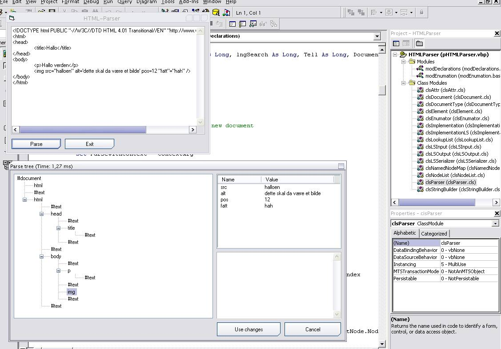



## A DOM\-Compliant and fast HTML/XML\-Parser written from scratch\.

### Description

This is a pretty fast HTTP/XML-parser written purely in Visual Basic from scratch. I've tried my best to make it compliant with the DOM-standard, though it currently only support DOM Level 1. The ZIP-file also include a DOM Inspector that both browse and edit a parsed document, plus a very simple and unfinished illustration of how this parser might be utilized to make a own web-browser control - without the use of IE or other browsers.
 
### More Info
 
The parser does not yet support namespaces, I'm afraid.

             |
---                |---
**Submitted On**   |2005-06-28 20:09:08
**By**             |[Kristian S\. Stangeland](https://github.com/Planet-Source-Code/PSCIndex/blob/master/ByAuthor/kristian-s-stangeland.md)
**Level**          |Advanced
**User Rating**    |4.4 (44 globes from 10 users)
**Compatibility**  |VB 6\.0
**Category**       |[Internet/ HTML](https://github.com/Planet-Source-Code/PSCIndex/blob/master/ByCategory/internet-html__1-34.md)
**World**          |[Visual Basic](https://github.com/Planet-Source-Code/PSCIndex/blob/master/ByWorld/visual-basic.md)
**Archive File**   |[A\_DOM\-Comp191146792005\.zip](https://github.com/Planet-Source-Code/kristian-s-stangeland-a-dom-compliant-and-fast-html-xml-parser-written-from-scratch__1-61616/archive/master.zip)

### API Declarations

Alot.

